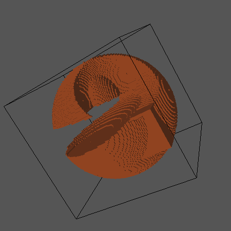

# Sculptor
An C++ program for drawing 3D sculptures and save them in .OFF or .VECT 

The Doxygen documentation page can be accessed [here](https://delreyn.github.io/Sculptor).

Example of an OFF Format opened with [Geomview](http://geomview.org):

